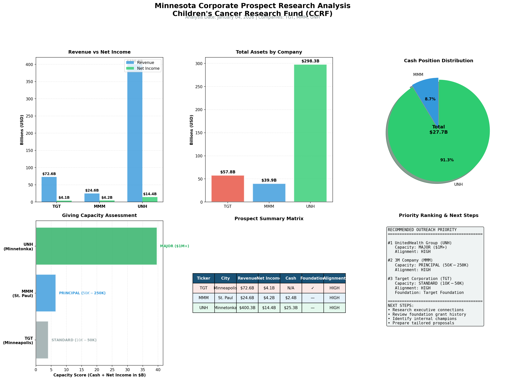

# Minnesota Corporate Prospect Research Tool

> Automated prospect research tool for nonprofit development teams, analyzing Fortune 500 companies for donor cultivation.



## Overview

This project demonstrates how to leverage publicly available APIs to systematically gather and analyze information about prospective corporate donors. Built as a portfolio piece for nonprofit development research roles, it showcases technical skills in data collection, analysis, and visualization while maintaining compliance with APRA (Association of Professional Researchers for Advancement) ethical standards.

### What It Does

- 🔍 **Fetches company data** from SEC EDGAR (financials, filings, company info)
- 📊 **Pulls foundation data** from ProPublica Nonprofit Explorer (IRS 990 filings)
- 💰 **Calculates giving capacity** based on cash position and net income
- 🎯 **Assesses mission alignment** for pediatric health/cancer research causes
- 📈 **Generates visual dashboard** comparing multiple prospects
- 📁 **Exports structured JSON** for CRM integration

### Companies Analyzed (Demo)

| Company | Ticker | Location | Industry |
|---------|--------|----------|----------|
| Target Corporation | TGT | Minneapolis, MN | Retail |
| 3M Company | MMM | St. Paul, MN | Medical Devices |
| UnitedHealth Group | UNH | Minnetonka, MN | Healthcare |

---

## Sample Output

### Financial Comparison

| Metric | Target | 3M | UnitedHealth |
|--------|--------|-----|--------------|
| Revenue | $72.6B | $24.6B | $400.3B |
| Net Income | $4.1B | $4.2B | $14.4B |
| Cash Position | N/A | $2.4B | $25.3B |
| Total Assets | $57.8B | $39.9B | $298.3B |

### Capacity Ratings

- **UnitedHealth Group**: MAJOR ($1M+ gift capacity)
- **3M Company**: PRINCIPAL ($50K-$250K)
- **Target Corporation**: STANDARD ($10K-$50K)

---

## Installation

### Requirements

- Python 3.8+
- Required packages: `requests`, `matplotlib`, `numpy`

### Setup

```bash
# Clone the repository
git clone https://github.com/YOUR_USERNAME/minnesota-prospect-research.git
cd minnesota-prospect-research

# Install dependencies
pip install requests matplotlib numpy

# Run the analysis
python minnesota_prospect_research.py
```

---

## Usage

### Basic Usage

```bash
python minnesota_prospect_research.py
```

This will:
1. Analyze the 3 configured Minnesota companies
2. Generate individual JSON profiles for each company
3. Create a combined analysis JSON file
4. Produce a visual dashboard (PNG)

### Customizing Companies

Edit the `MINNESOTA_COMPANIES` list in the script:

```python
MINNESOTA_COMPANIES = [
    {"ticker": "TGT", "name": "Target Corporation", "city": "Minneapolis"},
    {"ticker": "MMM", "name": "3M Company", "city": "St. Paul"},
    {"ticker": "UNH", "name": "UnitedHealth Group", "city": "Minnetonka"},
]
```

Replace with any public company tickers you want to research.

---

## Data Sources

All data comes from **free, publicly available APIs** — no paid subscriptions required.

| Source | Data Provided | API Endpoint |
|--------|---------------|--------------|
| **SEC EDGAR** | Company info, XBRL financials | `data.sec.gov` |
| **ProPublica** | IRS Form 990 foundation data | `projects.propublica.org/nonprofits/api/v2` |

### SEC EDGAR Data Retrieved
- Company name, CIK, ticker
- Industry (SIC code)
- Business address
- Net income, total assets, cash position
- Recent SEC filings

### ProPublica 990 Data Retrieved
- Corporate foundation name and EIN
- Foundation assets and revenue
- Annual grant distributions
- Ruling date

---

## Output Files

| File | Description |
|------|-------------|
| `minnesota_prospect_dashboard.png` | Visual comparison dashboard |
| `minnesota_prospects_combined.json` | All companies in one JSON file |
| `TGT_prospect_profile.json` | Target Corporation profile |
| `MMM_prospect_profile.json` | 3M Company profile |
| `UNH_prospect_profile.json` | UnitedHealth Group profile |

### JSON Structure

```json
{
  "ticker": "UNH",
  "company": {
    "name": "UnitedHealth Group",
    "sic_description": "Hospital & Medical Service Plans",
    "state": "DE"
  },
  "financials": {
    "revenue": {"value": 400342000000, "period_end": "2024-12-31"},
    "net_income": {"value": 14400000000, "period_end": "2024-12-31"},
    "cash_and_equivalents": {"value": 25310000000, "period_end": "2024-12-31"}
  },
  "capacity": {
    "score": 39.71,
    "rating": "MAJOR ($1M+)"
  },
  "alignment": {
    "level": "HIGH",
    "factors": ["Healthcare sector - STRONG alignment..."]
  }
}
```

---

## APRA Ethics Compliance

This tool is designed in full compliance with the [APRA Statement of Ethics](https://www.aprahome.org/Resources/Statement-of-Ethics):

| Principle | Implementation |
|-----------|----------------|
| ✅ **Lawful Collection** | Uses only publicly available APIs |
| ✅ **Attribution** | All data sources documented |
| ✅ **Transparency** | Tool identifies itself via User-Agent header |
| ✅ **Relevance** | Collects only fundraising-relevant information |
| ✅ **Confidentiality** | Outputs marked for internal use only |

---

## Technical Architecture

```
┌─────────────────────────────────────────────────────────────┐
│                    DATA COLLECTION                          │
├─────────────────────┬───────────────────────────────────────┤
│   SEC EDGAR API     │     ProPublica Nonprofit API          │
│   - Company Info    │     - Foundation Search               │
│   - XBRL Financials │     - 990 Filing Details              │
└─────────┬───────────┴───────────────┬───────────────────────┘
          │                           │
          ▼                           ▼
┌─────────────────────────────────────────────────────────────┐
│                    DATA PROCESSING                          │
│   - Normalize financial data                                │
│   - Calculate capacity scores                               │
│   - Assess mission alignment                                │
└─────────────────────────────┬───────────────────────────────┘
                              │
                              ▼
┌─────────────────────────────────────────────────────────────┐
│                    OUTPUT GENERATION                        │
├──────────────────┬──────────────────┬───────────────────────┤
│   JSON Profiles  │  Visual Dashboard │  Priority Rankings   │
└──────────────────┴──────────────────┴───────────────────────┘
```

---

## Potential Enhancements

- [ ] Integration with wealth screening services (iWave, WealthEngine)
- [ ] Automated scheduling for regular prospect pool refreshes
- [ ] CRM integration (Salesforce NPSP, Raiser's Edge NXT)
- [ ] News API integration for recent philanthropic announcements
- [ ] Executive relationship mapping
- [ ] Machine learning for predictive capacity scoring

---

## Use Cases

1. **Development Research Teams** — Automate initial prospect screening
2. **Major Gift Officers** — Quick capacity assessment before meetings
3. **Corporate Partnership Managers** — Identify companies with foundation giving programs
4. **Grant Writers** — Research corporate foundations for grant applications

---

## License

This project is licensed under CC BY-NC 4.0 - free for personal use, no commercial use allowed. 

```
Creative Commons Attribution-NonCommercial 4.0 International License (CC BY-NC 4.0)
Copyright (c) 2025 dextersrobot
This work is licensed under the Creative Commons Attribution-NonCommercial 4.0 International License.
You are free to:
- Share — copy and redistribute the material in any medium or format
- Adapt — remix, transform, and build upon the material
Under the following terms:
- Attribution — You must give appropriate credit, provide a link to the license, and indicate if changes were made.
- NonCommercial — You may NOT use the material for commercial purposes.
No additional restrictions — You may not apply legal terms or technological measures that legally restrict others from doing anything the license permits.
Full license text: https://creativecommons.org/licenses/by-nc/4.0/legalcode
THE SOFTWARE IS PROVIDED "AS IS", WITHOUT WARRANTY OF ANY KIND, EXPRESS OR IMPLIED, INCLUDING BUT NOT LIMITED TO THE WARRANTIES OF MERCHANTABILITY, FITNESS FOR A PARTICULAR PURPOSE AND NONINFRINGEMENT. IN NO EVENT SHALL THE AUTHORS OR COPYRIGHT HOLDERS BE LIABLE FOR ANY CLAIM, DAMAGES OR OTHER LIABILITY, WHETHER IN AN ACTION OF CONTRACT, TORT OR OTHERWISE, ARISING FROM, OUT OF OR IN CONNECTION WITH THE SOFTWARE OR THE USE OR OTHER DEALINGS IN THE SOFTWARE.
```

---


## Acknowledgments

- SEC EDGAR for providing free access to company filings
- ProPublica for the Nonprofit Explorer API
- APRA for ethical guidelines in prospect research

---

*Built with Python, matplotlib, and publicly available data APIs.*
